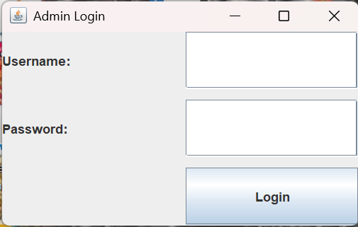
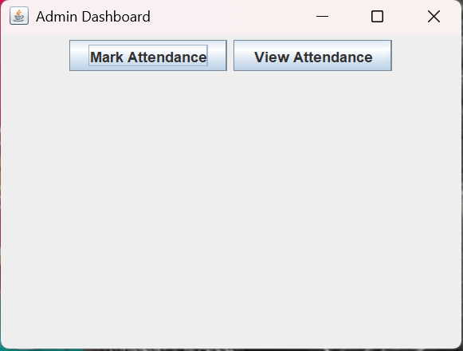
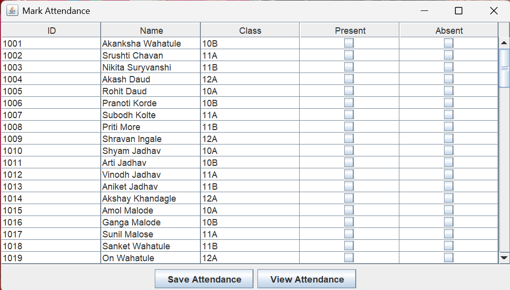
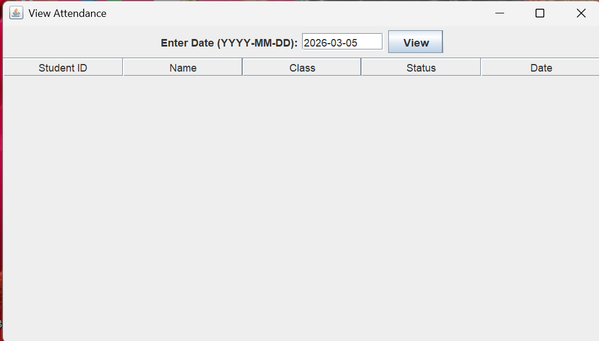
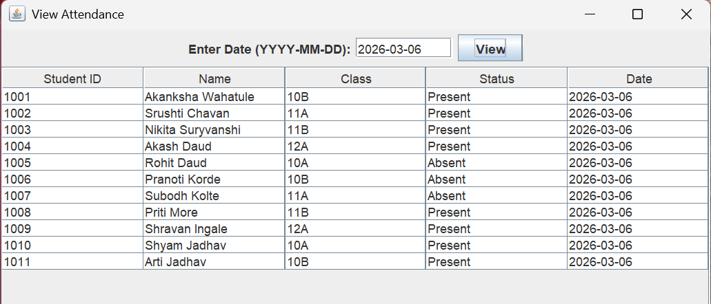

# 🎓 Student Attendance Management System

## 📌 Project Description

A Java-based desktop application developed using Swing and JDBC to efficiently manage student attendance. The system provides secure admin authentication,
real-time attendance marking, and seamless data storage and retrieval using a MySQL database.

## 🛠️ Technologies Used

* Java (Core Java, OOP)
* Java Swing (GUI)
* JDBC (Java Database Connectivity)
* MySQL

## ✨ Features

* 🔐 Admin Login with authentication
* 📝 Mark Attendance for students
* 📊 View Attendance records
* 💾 Data stored and retrieved using MySQL database

## 📁 Project Structure

| File Name           | Description                                |
| ------------------- | ------------------------------------------ |
| AdminLogin.java     | Admin login screen with authentication     |
| DBConnection.java   | Handles MySQL database connection via JDBC |
| MainDashboard.java  | Main dashboard after successful login      |
| MarkAttendance.java | UI to mark student attendance              |
| ViewAttendance.java | UI to view attendance records              |
| TestConnection.java | Tests database connectivity                |

## ▶️ How to Run

1. Install Java JDK and MySQL
2. Create a database in MySQL
3. Import the required table (see below)
4. Update database credentials in `DBConnection.java`
5. Open the project in Eclipse or IntelliJ
6. Run `MainDashboard.java`

## 🗄️ Database Setup

```sql
CREATE TABLE attendance (
  id INT PRIMARY KEY AUTO_INCREMENT,
  student_name VARCHAR(50),
  date DATE,
  status VARCHAR(10)
);
```

## 📷 Screenshots

*(Add your screenshots here — update file names as per your folder)*

## 📷 Screenshots

### 🔐 Login Screen


### 🏠 Dashboard


### 📝 Mark Attendance


### 📊 View Attendance


### 📋 Student List



## 💡 Key Learnings

* Practical implementation of JDBC for database connectivity
* Experience with Java Swing for building GUI applications
* Understanding of CRUD operations using MySQL
* Debugging and exception handling in Java


## 🚀 Future Improvements

* Add student login functionality
* Implement attendance reports and analytics
* Enhance UI using JavaFX
* Add role-based access control


## 👩‍💻 Developer

**Srushti Chavan**
B.Sc. Computer Science
Dr. Babasaheb Ambedkar Marathwada University

📧 [srushtichavan73@gmail.com](mailto:srushtichavan73@gmail.com)
